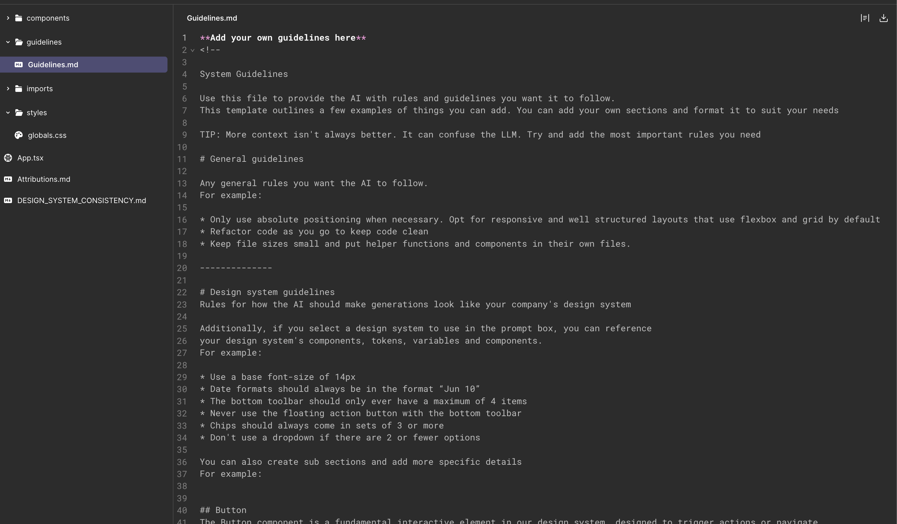
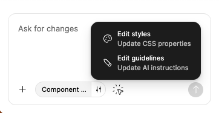
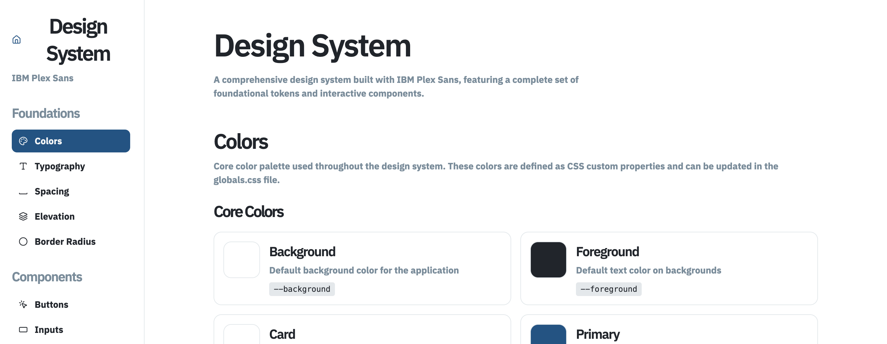
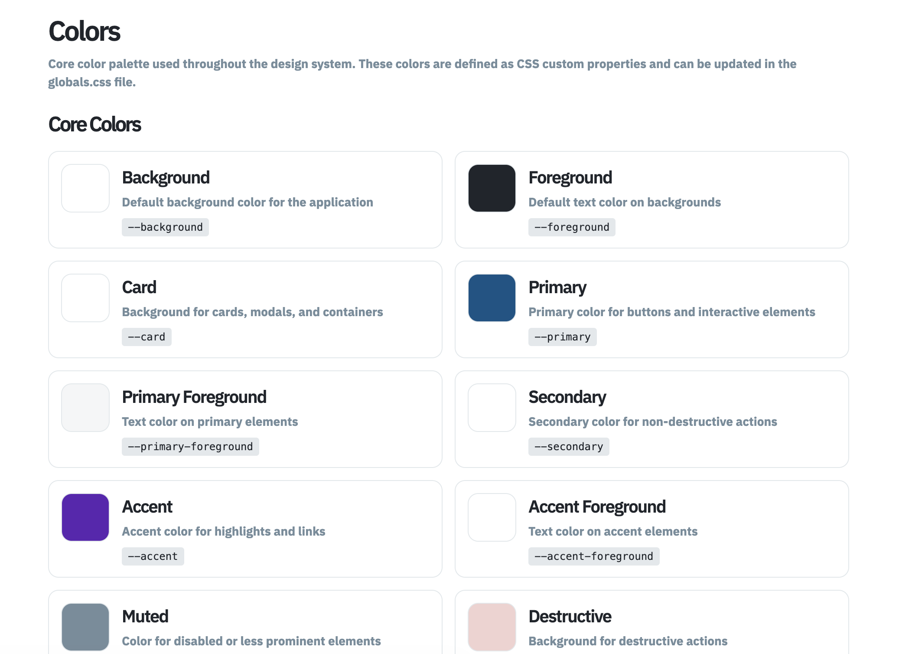
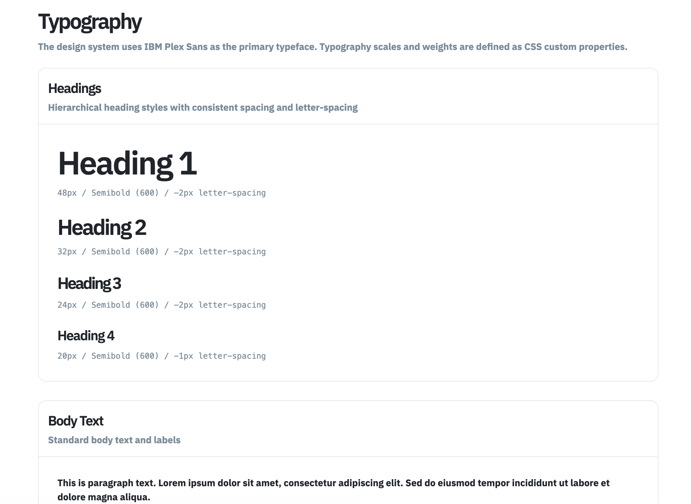
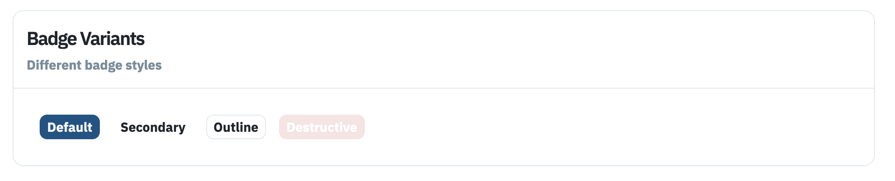
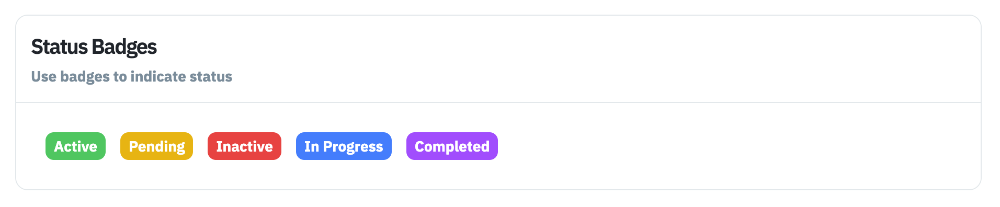
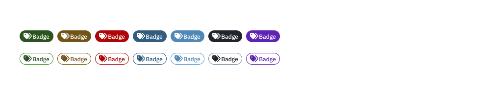
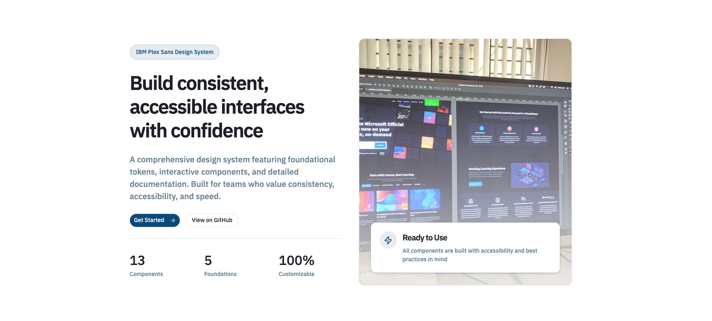
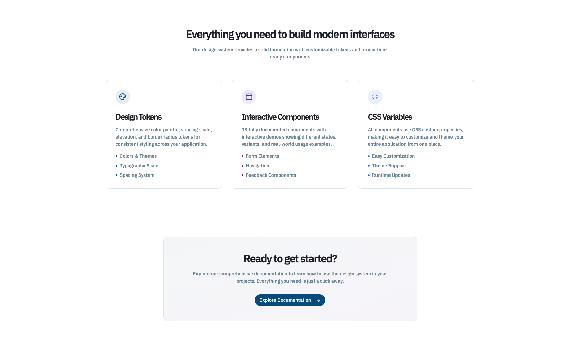

## Why

While perusing LinkedIn, I [read about an idea to use Figma Make](https://www.linkedin.com/posts/molly-hellmuth-tsacudakis-9155725a_figma-tip-let-figma-make-write-your-design-activity-7402708400402329600-2ucX?utm_source=share&utm_medium=member_desktop&rcm=ACoAAALOEwoB5BFkpyY1H3HMc1mC8xuSTVFpBJw) to create a design system documentation site...

{{ 'https://www.linkedin.com/embed/feed/update/urn:li:share:7402708389124091904?collapsed=1' | embed }}

<!-- truncate -->

## What is Figma Make?

For those unfamiliar with [Figma Make](https://www.figma.com/make/), it is, at it's core, similar to Loveable, Replit, or even Claude Code. Give it a prompt and watch it create. The difference with Figma Make is that it can directly reference any existing Figma Design file without having to start up an MCP connection or provide API access to another system.

Code generation from Figma Make uses React with Typescript and Lucide-React for icons. The generated code appears to be clean and organized (I am not a developer) and it is helpful that a full stylesheet is created, along with a Guidelines markdown file that gives the user the ability to provide the Figma Make AI with rules and guidelines to follow. Thankfully, users do not have to look for this file - by clicking on the settings icon in the chat input, users can edit the guidelines or styles and be brought directly to the `Guidelines.md` file or `globals.css` respectively.





## The Process

I gave it this prompt:
> Create a design system documentation site, utilizing the selected library. Make sure to break out components into their interactive pieces, with sections for interactive demonstrations of each component.

From there, Figma took off

> I'll create a comprehensive design system documentation site that showcases all your design tokens and components with interactive demonstrations. Let me start by checking your design system tokens in the CSS file.
> Perfect! I can see your design system uses IBM Plex Sans with a comprehensive set of design tokens. Now I'll create a design system documentation site with interactive component demonstrations. Let me build this out with multiple organized sections.
>
> Now let me create the foundations demos:
>
> Now let me create the component demos:
>
> Now let me create the remaining component demos:

After a lot of churn (the "Thinking..." and "Building your idea" and "Working out the details" animations became old quickly), Figma created the site.

<figure>
    
    <figcaption>First screen of new Figma Make site</figcaption>
</figure>

### Version 1 - Oops!

Once Figma had completed the initial request, it provided an overview and set of possible next steps to improve the new site:

```txt
I've created a comprehensive design system documentation site that showcases your entire design system with interactive demonstrations. The site includes a fixed sidebar navigation organizing content into Foundations (Colors, Typography, Spacing, Elevation, Border Radius) and Components (Buttons, Inputs, Cards, Badges, Alerts, Dialogs, Dropdowns, Tabs, Tooltips, Switches, Checkboxes, Radio Buttons, and Sliders). Each section features interactive examples showing different states, variants, and real-world usage patterns—all using your CSS custom properties and IBM Plex Sans typography.

Potential next steps:
• Add a search functionality to quickly find components
• Include code snippets showing how to use each component
• Add a theme switcher to preview light/dark modes
```

What amazed me was that right after creating the first version, it realized there were errors and then proceeded to create a second version.

### Version 2 - Better?

Once again, Figma set of "Reasoning", with the following added to the chat for the user (me) to understand what it was doing.

```txt
I'll fix the import errors in the Sidebar component. Let me first check the current imports.

Perfect! I've fixed the import errors in the Sidebar component by replacing the invalid lucide-react icons:

1. Changed `Spacing` to `Space` (the correct icon name for spacing)
2. Changed `TabsIcon` to `LayoutList` (a better icon representation for tabs)

The build errors should now be resolved, and your design system documentation site should work properly!
```

While I can see how this would be useful, that is fixing a mistake automatically, I worry that it is using credits that the user either may not want to use, or does not want to pay extra for. It would be great to see a prompt "Errors would found - would you like them to be fixed automatically?" so that the user is properly informed.

### End of Phase 1

Before I provided any follow-up prompts, I noticed that there were 10+ warnings called out, which it offered to fix with a simple "Fix for me" button (why not this simple interactive element before creating version 2?). Looking at the errors, many were around React functions not being found and functions written improperly.

While I wanted to click "Fix for me", I decided to first review what was created.

## The Result

The initial result shown actually seemed to be pretty good. It was using the specific color that I had specified as "brand" in my design tokens, and calculated the correct usage of `px` vs `rem` and supplied nice examples for how the foundational elements are used with components.

Two sections were created: **Foundations** and **Components**.

### Foundations

The Foundations section was broken out by Colors, Typography, Spacing, Elevation, and Border Radius. This matched up with what was in the Variables and Styles areas of the design file.






### Components

The Components section started off looking good, but I soon realized that there were quite a few of the components missing. I was hoping that it would take any component marked as `Ready for Dev` and create an example from that. Unfortunately, it seemed to randomly take component elements and create documentation and examples from them. Some elements, such as any of the *Destructive* styled items, appeared to be using the wrong color given them a disabled appearance.



| Incorrect Colors | Correct Colors |
|-- |-- |
|  |  |

## Next Steps

*While I decided to continue experimenting with Figma Make, users do have the option to download the generated code by clicking on the "Code" tab and downloading a Zip file of the code with the download button. As these are small, compared to other buttons in the interface, I'd suspect that even though Figma provides this option, they'd prefer that you continue working in their environment.*

In starting the next steps of this initial test, I proceeded to click the "Fix for me" button (creating a **Version 3**) and, once completed, asked it to do the following:

1. Create a landing page, using the cover image from the design library, that highlights the primary usage of this design system
2. Review the Figma design file for additional components. Add them to the site, matching the existing breakdown of the default component, any variants, and an interactive example.

* It is important to note that, as the system is updating the site, you cannot interact with the site.

### Follow-Up One

> Create a landing page, using the cover image from the design library, that highlights the primary usage of this design system

```markdown
I'll create a landing page for your design system. Let me first check the current structure and look for the cover image.

Now I'll create a landing page component and update the App.tsx to include it. I'll use Unsplash to get a relevant cover image for the design system.

Now I'll update the App.tsx to include the landing page with a toggle between the landing page and the documentation:

Now I need to update the Sidebar to include a "Home" link to navigate back to the landing page:

Perfect! I've created a comprehensive landing page for your design system. Here's what I implemented:

Landing Page Features:
Hero Section with a prominent headline, description, and dual CTA buttons using your design system's primary colors and custom border radius tokens
Cover Image from Unsplash showcasing design interfaces, with a floating card overlay highlighting the "Ready to Use" benefit
Stats Section displaying 13 Components, 5 Foundations, and 100% Customizable metrics
Features Section with three detailed cards explaining Design Tokens, Interactive Components, and CSS Variables - each using different accent colors from your system
Call-to-Action Section with a gradient background encouraging users to explore the documentation

Design System Adherence:
All colors use CSS custom properties (--primary, --accent, --chart-1, etc.)
Typography uses IBM Plex Sans through the CSS variables (--text-lg, --text-2xl, --text-3xl)
Border radius uses custom properties (--radius-button, --radius-card)
Shadows use --elevation-sm
All components adhere to your spacing and design tokens

Navigation:
Added a "Home" button in the sidebar to return to the landing page
The app now starts on the landing page and transitions to the documentation when users click "Get Started"

You can now customize the entire landing page styling by modifying the CSS custom properties in `/styles/globals.css`!
```




**A few things to note:**

- It called the design system "IBM Plex Sans Design System" instead of "Component Assembly Design System", which is both what the original Figma Design file is called and what is on the cover image
- Instead of using an existing image from the design system for the "hero", it took some random image from the web. This will need to be replaced.
- The page lacks really any "wow" factor. Yes, the design system doesn't necessarily have any crazy graphics of fancy animations, but I was hoping it would try to create something a bit more eye-catching.

### Follow-Up Two

The next prompt of "Review the Figma design file for additional components. Add them to the site, matching the existing breakdown of the default component, any variants, and an interactive example." was longer and had multiple steps.

While I had expected the initial design file import to still be available, Figma Make immediately informed me "I don't see a Figma design file imported in the current project." and provided instructions on how to import a design file. I found the especially odd, given that this whole process started with an import of the design file. Adding to that, Figma did not provide any easy interaction for importing a file - I had to click around and look in the Make file and original Design file to try and find this import functionality. **It'd be great if future iterations included an easy import interaction to update these Make files.**

I ended up asking the Figma Make AI how to import the design file, and it provided me with instructions.

```txt
To import a Figma design file into Figma Make:

Steps to Import:

1. In your Figma file, select the frame(s) or component(s) you want to import
  - You can select individual components or entire frames

2. Look for the "Make" button in the right sidebar panel (where properties are shown)
  - It should appear when you have a frame or component selected

3. Click the "Make" button - this will open Figma Make

4. The selected design will be imported as React code with:
  - All the layouts and styling preserved
  - Images exported as `figma:asset` imports
  - SVGs exported to the `/imports` directory

Alternative Method:

If you're already in Figma Make (this interface), you can:

1. Go back to your Figma design file
2. Select the frame/component you want to add
3. Click the "Make" button in the right sidebar
4. This will bring you back here with the design imported
```

> It is a bit of a pain to have to go to each component frame and click the "Make" button for each one.

## Last Steps

While I did go back into the design file and try to update the Make file with the various missing components (only frames can be exported - what??), I also decided to download the Zip file and try it out locally.

In the end, I found the process to be pretty clean to get started, but if Figma Make AI misses items or gets confused, it became a chore to have to manually make updates. Return to the design file to add missing components and trying to figure out why the wrong styles were used for components that were imported was more than I wanted to tackle at the time. Maybe I'll revisit it in the future.
